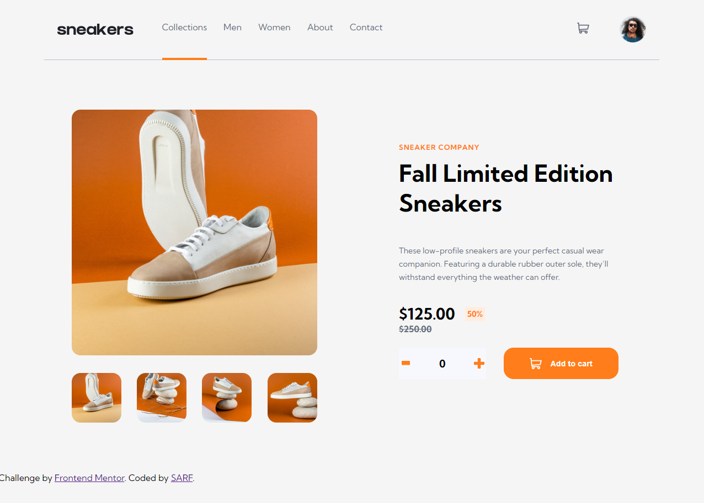

# Frontend Mentor - E-commerce product page solution

This is a solution to the [E-commerce product page challenge on Frontend Mentor](https://www.frontendmentor.io/challenges/ecommerce-product-page-UPsZ9MJp6). Frontend Mentor challenges help you improve your coding skills by building realistic projects.

## Table of contents

- [Overview](#overview)
  - [The challenge](#the-challenge)
  - [Screenshot](#screenshot)
  - [Links](#links)
- [My process](#my-process)
  - [Built with](#built-with)
- [Author](#author)

## Overview

### The challenge

Users should be able to:

- View the optimal layout for the site depending on their device's screen size
- See hover states for all interactive elements on the page
- Open a lightbox gallery by clicking on the large product image
- Switch the large product image by clicking on the small thumbnail images
- Add items to the cart
- View the cart and remove items from it

### Screenshot

### Links

- [Solution URL:](https://abisol-2711.github.io/Day62/)
- [Live Site URL:](https://your-live-site-url.com)

## My process

### Built with

- [HTML](https://developer.mozilla.org/en-US/docs/Web/HTML)
- [CSS](https://developer.mozilla.org/en-US/docs/Web/CSS)
- [SASS](https://sass-lang.com/documentation/)
- [Javascript](https://developer.mozilla.org/en-US/docs/Web/JavaScript)

## Author

- [Linkedin](https://www.linkedin.com/in/sol-r%C3%A1zuri-fullstackdeveloper/)
- [Frontend Mentor](https://www.frontendmentor.io/profile/Abisol-2711)
- [Github](https://github.com/Abisol-2711)

